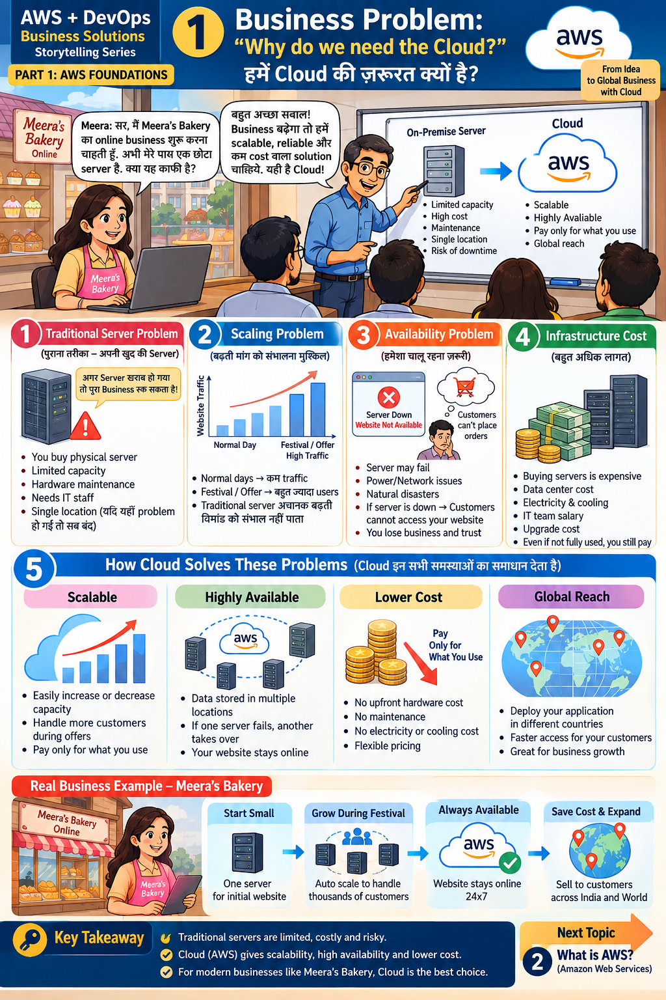

# Lesson 1 · Business Problem: "Why do we need the Cloud?"
**हमें Cloud की ज़रूरत क्यों है?**

`Part 1 · AWS Foundations` · ⏱ 45 min · 💰 Free · Level: Beginner



## 🎯 Learning objectives
After this lesson you can:
- Explain the problems of running your own (on-premise) server.
- Define **scalability, availability, cost and global reach** in simple words.
- Explain how the cloud solves each problem with a real business example.

## 📖 The story
Meera wants to start **Meera's Bakery Online**. She has one small server. She asks:
*"Sir, is this enough?"* Her teacher answers: *"If the business grows you need a solution
that is scalable, reliable and low-cost. That is the Cloud."*

## 🧠 Concepts (panel by panel)

### Panel 1 — Traditional server problem (पुराना तरीका)
You buy a physical server and run it yourself.
- Limited capacity — it can only serve so many customers.
- Hardware needs maintenance; you need IT staff.
- **Single location** — if it fails, *the whole business stops*.

### Panel 2 — Scaling problem (बढ़ती मांग)
Normal day = few visitors. **Festival / offer day = a huge spike.** A fixed server cannot grow
suddenly, so customers see errors and leave. (Try it: the simulation below.)

### Panel 3 — Availability problem
Servers fail. Power cuts, network problems and disasters happen. If the site is down, customers
cannot order and you lose **money and trust**.

### Panel 4 — Infrastructure cost
Buying servers is expensive: data-center space, electricity, cooling, IT salaries, upgrades.
**You pay even when the server is idle.**

### Panel 5 — How the cloud solves these problems
| Problem | Cloud answer |
|---------|--------------|
| Limited capacity | **Scalable** — add/remove capacity in minutes |
| Single point of failure | **Highly available** — data in several locations; another takes over |
| High cost | **Lower cost** — no upfront hardware, *pay only for what you use* |
| Local only | **Global reach** — deploy near customers in other countries |

### Real business example — Meera's Bakery
`Start small (one server)` → `Grow during festival (auto-scale to thousands of customers)` →
`Always available 24×7` → `Save cost & expand (sell across India and the world)`.

### Two money words worth knowing
- **CapEx** (capital expense): big upfront purchase — the on-premise way.
- **OpEx** (operating expense): small regular payment for usage — the cloud way.

## 🛠️ Hands-on — "Festival day" simulation (no AWS account needed)

1. Open the terminal in VS Code (Ctrl + `).
2. Run:
   ```bash
   python scripts/lesson01_capacity_simulation.py
   ```
3. Read the table. On **Festival!** day the fixed server loses thousands of customers while the
   cloud column simply uses more servers for one day and returns to 1 afterwards.
4. Edit the numbers at the top of the script (`REQUESTS`, `SERVER_CAPACITY`) and run again.
   Questions to answer in your notebook:
   - What capacity would the on-prem server need to survive the festival? What would it cost every other day?
   - What happens to the cloud cost if *every* day were a festival?

> The prices in the script are **made-up teaching numbers**, not AWS prices.

## 📁 Files for this lesson
- `scripts/lesson01_capacity_simulation.py`

## ⚠️ Common mistakes / misunderstandings
- *"Cloud means free."* No — it means **pay for what you use**, and you must still manage cost.
- *"Cloud = someone else's computer, so no responsibility for me."* You still own security of your data and settings (Lesson 3, 7).
- *"Cloud is always cheaper."* Usually for variable/unknown load; steady heavy load needs a cost review.

## ✅ Best practices
- Start small and scale as the business grows.
- Think about *failure* from day one (availability).
- Treat cost as a feature: budgets and alerts (Lesson 2).

## 📝 Quiz
1. Name three problems of a single on-premise server.
2. What does "pay only for what you use" mean?
3. Which cloud benefit helps during a festival traffic spike?
4. Why is a single location risky?

<details><summary>Show answers</summary>

1. Limited capacity, maintenance/staff needed, single point of failure, high upfront cost.
2. You are billed for the resources/time actually consumed, not for idle owned hardware.
3. Scalability (elasticity).
4. If that location has a power/network/disaster problem, the whole business is offline.
</details>

## 🏠 Assignment
Choose any local business (shop, tuition centre, clinic). Write half a page: *three problems it
would face with its own server, and which cloud benefit solves each.*

## 🔑 Key takeaway
Traditional servers are **limited, costly and risky**. The cloud gives **scalability, high
availability and lower cost** — the best choice for modern businesses like Meera's Bakery.

**हिंदी में सार:** अपना सर्वर सीमित, महंगा और जोखिम भरा होता है। Cloud में ज़रूरत के हिसाब से
capacity बढ़ा-घटा सकते हैं, सेवा हमेशा चालू रहती है और सिर्फ़ उपयोग का पैसा देना पड़ता है।

➡️ **Next:** [Lesson 2 — What is AWS?](02-what-is-aws.md)
