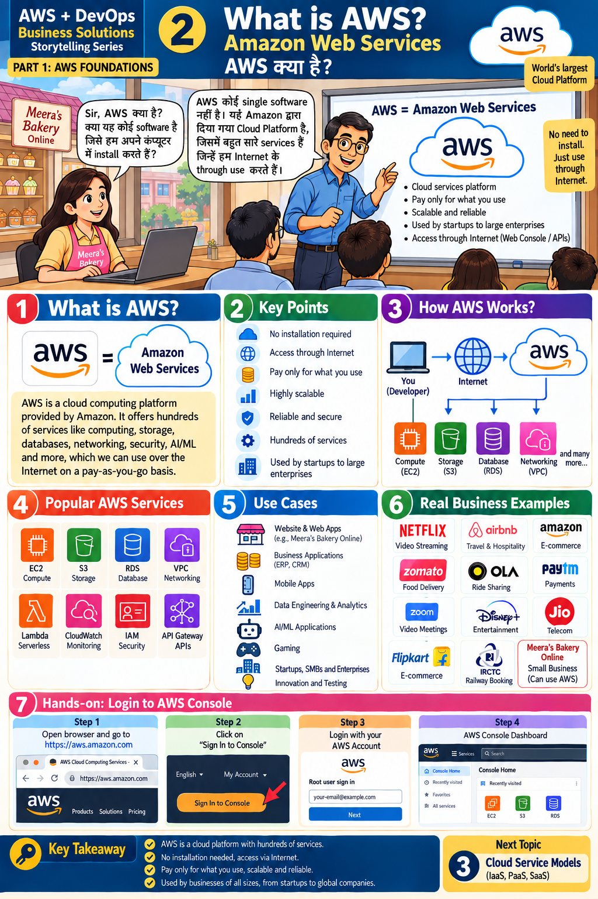

# Lesson 2 · What is AWS? (Amazon Web Services)
**AWS क्या है?**

`Part 1 · AWS Foundations` · ⏱ 60 min · 💰 Free (Free Tier + budget alert) · Level: Beginner

## 🎯 Learning objectives
- Explain what AWS is and what "no install, pay-as-you-go" means.
- Name popular AWS services and match them to business use.
- Create an AWS account safely and sign in to the console.

## 📖 The story
Meera asks: *"Sir, is AWS software I install on my computer?"* Answer: *"No. AWS is a **cloud
platform** by Amazon with many services you use **through the Internet**."*

## 🧠 Concepts

### What is AWS?
AWS = **A**mazon **W**eb **S**ervices — the world's largest cloud platform. It offers hundreds
of services: computing, storage, databases, networking, security, AI/ML and more.

### Key points (panel 2)
No installation · access through Internet · pay only for what you use · highly scalable ·
reliable and secure · hundreds of services · used from startups to large enterprises.

### How AWS works (panel 3)
`You (developer)` → `Internet` → `AWS` → **Compute (EC2)**, **Storage (S3)**, **Database (RDS)**,
**Networking (VPC)** … You can reach AWS through the **web console**, the **CLI**, or **APIs/SDKs**.

### Popular services (panel 4)
| Service | Category | One-line meaning |
|---------|----------|------------------|
| EC2 | Compute | Virtual servers |
| S3 | Storage | Files/images in buckets |
| RDS | Database | Managed SQL databases |
| VPC | Networking | Your private network |
| Lambda | Serverless | Run code without servers |
| CloudWatch | Monitoring | Metrics, logs, alarms |
| IAM | Security | Users and permissions |
| API Gateway | APIs | Create/manage APIs |

### Use cases & real examples (panels 5–6)
Websites, ERP/CRM, mobile apps, analytics, AI/ML, gaming. Well-known companies run on AWS
(streaming, travel, e-commerce, food delivery, payments, telecom). Meera's Bakery is the small-business example.

### The Free Tier
New accounts get limited free usage for many services for a period, plus some always-free
allowances. **Rules change — always read the current Free Tier page in the console** (Billing ▸ Free Tier).

## 🛠️ Hands-on — create an account and log in (panel 7)

1. Open a browser → **https://aws.amazon.com** → **Create an AWS Account**.
2. Provide e-mail + account name + strong password; add contact and payment details; verify phone.
3. Choose **Basic support – Free**.
4. Click **Sign In to the Console** → pick **Root user** → enter the e-mail → *Next* → password.
5. You land on **Console Home** (you will explore it in Lesson 6).
6. **Protect the account right now:**
   1. Click your account name (top right) ▸ **Security credentials** ▸ **Assign MFA device** ▸ choose *Authenticator app* ▸ scan the QR code ▸ enter two consecutive codes.
   2. Search **Budgets** in the search box ▸ **Create budget** ▸ *Use a template → Monthly cost budget* (e.g. 5 USD) ▸ add your e-mail.
7. Sign out and sign in again to confirm MFA works.

> ⚠️ **Root user = owner of everything.** After Lesson 7 you will create an IAM user and stop using root.

## 📁 Files for this lesson
No code yet. Read [`01-environment-setup.md`](../01-environment-setup.md) section 5.

## ⚠️ Common mistakes
- Using a weak root password or skipping MFA.
- Forgetting the budget alert, then being surprised by a bill.
- Leaving practice resources running.
- Confusing **AWS** (the platform) with a single product.

## ✅ Best practices
MFA on root · budget alerts · use IAM users · tag and clean up resources · choose one Region for learning (`ap-south-1`).

## 📝 Quiz
1. Do you install AWS on your computer?
2. Which service stores files and images? Which one runs virtual servers?
3. Name two ways to access AWS besides the console.
4. Why create a budget alert?

Show answers

1. No — you access it over the Internet.
2. S3 stores files; EC2 runs virtual servers.
3. AWS CLI and SDKs/APIs.
4. To get notified before costs grow unexpectedly.

## 🏠 Assignment
Take screenshots (hide your account ID and e-mail) of: Console Home, MFA enabled, the budget you created.
Write which three AWS services you think a school website would need, and why.

## 🔑 Key takeaway
AWS is a cloud platform with hundreds of services, reached over the Internet, billed by usage,
scalable and reliable — from startups to global companies.

**हिंदी में सार:** AWS कोई एक software नहीं, Amazon का Cloud Platform है। Install करने की ज़रूरत नहीं,
Internet से use करें और जितना इस्तेमाल करें उतना ही पैसा दें।

⬅️ [Lesson 1](01-business-problem-why-cloud.md) · ➡️ **Next:** [Lesson 3 — Cloud Service Models](03-cloud-service-models.md)
