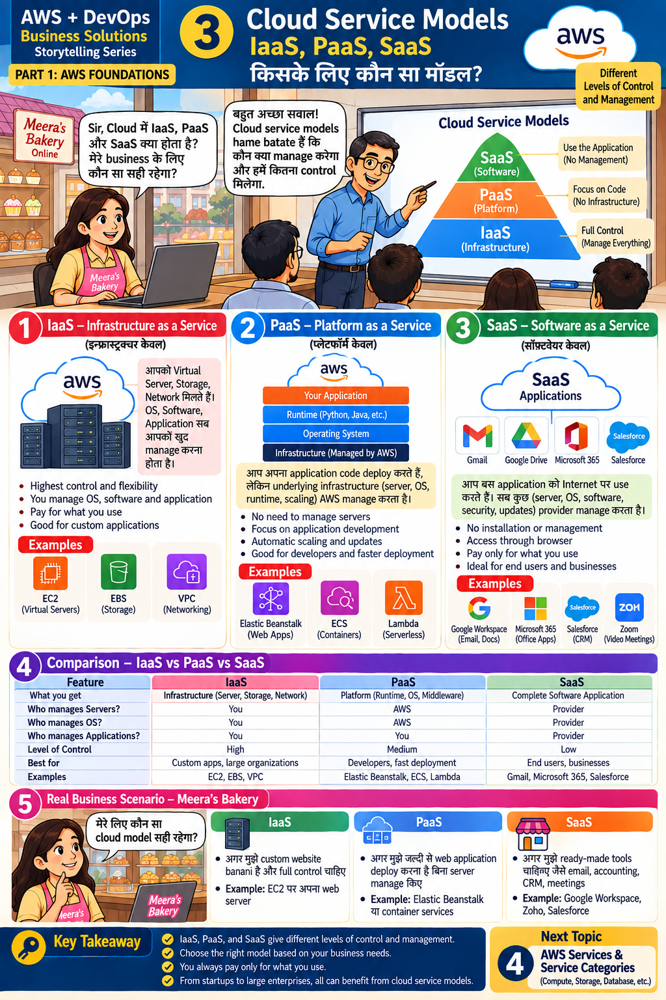

# Lesson 3 · Cloud Service Models — IaaS, PaaS, SaaS
**किसके लिए कौन सा मॉडल?**

`Part 1 · AWS Foundations` · ⏱ 45 min · 💰 Free · Level: Beginner



## 🎯 Learning objectives
- Define IaaS, PaaS and SaaS and say **who manages what**.
- Match AWS and everyday products to each model.
- Choose a model for a given business need.

## 📖 The story
Meera asks: *"What are IaaS, PaaS and SaaS? Which is right for my business?"*
Answer: *"The models tell us **who manages what** and **how much control** we get."*

## 🧠 Concepts

### The pyramid (top banner)
```
        SaaS  — use the application            (no management)
        PaaS  — focus on code                  (no infrastructure)
        IaaS  — full control                   (manage everything)
```

### Panel 1 — IaaS: Infrastructure as a Service
You get virtual servers, storage and networking. **You** manage the OS, software and application.
Highest control and flexibility. AWS examples: **EC2, EBS, VPC**.

### Panel 2 — PaaS: Platform as a Service
You deploy your **code**; the provider manages servers, OS, runtime and scaling.
AWS examples (as in the slide): **Elastic Beanstalk, ECS, Lambda**.

### Panel 3 — SaaS: Software as a Service
You just **use** the application in a browser. Gmail, Google Drive, Microsoft 365, Salesforce, Zoom.

### Panel 4 — Comparison table
| Feature | IaaS | PaaS | SaaS |
|---------|------|------|------|
| What you get | Servers, storage, network | Runtime, OS, middleware | Complete software |
| Who manages servers? | **You** | AWS | Provider |
| Who manages OS? | **You** | AWS | Provider |
| Who manages the application? | **You** | **You** | Provider |
| Control | High | Medium | Low |
| Best for | Custom apps, large orgs | Developers, fast deployment | End users, businesses |

### Panel 5 — Meera's decision
| Need | Choose | Example |
|------|--------|---------|
| Custom website, full control | IaaS | Own web server on EC2 |
| Deploy a web app quickly, no server management | PaaS | Elastic Beanstalk / containers |
| Ready-made tools (email, accounting, CRM, meetings) | SaaS | Google Workspace, Zoho, Salesforce |

### 🍕 The pizza analogy
*Make at home* = on-premise · *Kitchen rental* (you cook) = IaaS · *Take-and-bake* = PaaS · *Restaurant* = SaaS.

### Shared responsibility (important!)
Even in IaaS, AWS secures the **data centers and hardware**; **you** secure your data, passwords,
permissions and firewall rules. The higher you go (PaaS → SaaS), the more AWS takes over.

## 🛠️ Hands-on — classification exercise (paper or notebook)
Place each in IaaS / PaaS / SaaS, then check the answers:
`EC2` · `Lambda` · `Gmail` · `Elastic Beanstalk` · `EBS` · `Zoom` · `Salesforce` · `VPC`

Then answer: *Meera wants to send newsletters. Should she build an e-mail server on EC2 or buy a SaaS?* Write two reasons.

<details><summary>Show answers</summary>

IaaS: EC2, EBS, VPC · PaaS: Elastic Beanstalk, Lambda (often called *serverless/FaaS* — the slide groups it with PaaS) · SaaS: Gmail, Zoom, Salesforce.
Newsletters: SaaS — no servers to patch, deliverability handled by the provider, faster to start.
</details>

## 📁 Files for this lesson
None (theory). This lesson later helps you understand why Lesson 14 uses *containers* (a PaaS-like middle ground).

## ⚠️ Common mistakes
- Thinking "PaaS means no responsibility" — you still own app code and data.
- Choosing IaaS when a SaaS would solve the problem faster.
- Mixing models freely is normal: Meera can use SaaS email + PaaS app + IaaS database server.

## ✅ Best practices
Pick by business need · more control = more work · start with the highest-level service that meets requirements.

## 📝 Quiz
1. Who patches the operating system in IaaS? In PaaS?
2. Give one AWS example for each model.
3. Which model has the lowest control?
4. Which model suits a developer who wants fast deployment?

<details><summary>Show answers</summary>

1. You; AWS.  2. IaaS: EC2 · PaaS: Elastic Beanstalk · SaaS: Gmail (or Google Workspace, Zoom, Salesforce).  3. SaaS.  4. PaaS.
</details>

## 🏠 Assignment
Make a 3-column table for a coaching institute: which tools would be IaaS, PaaS, SaaS, and why.

## 🔑 Key takeaway
IaaS, PaaS and SaaS give different levels of **control and management**. Choose by business need;
you always pay for what you use.

**हिंदी में सार:** IaaS में सब आप manage करते हैं, PaaS में सिर्फ़ application, SaaS में कुछ नहीं —
बस software use करें। ज़रूरत के हिसाब से मॉडल चुनें।

⬅️ [Lesson 2](02-what-is-aws.md) · ➡️ **Next:** [Lesson 4 — Services & Categories](04-services-and-categories.md)
