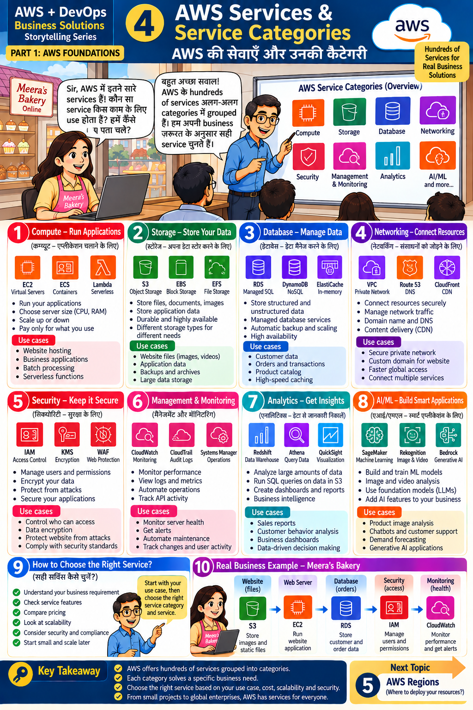

# Lesson 4 · AWS Services & Service Categories
**AWS की सेवाएँ और उनकी कैटेगरी**

`Part 1 · AWS Foundations` · ⏱ 60 min · 💰 Free · Level: Beginner



## 🎯 Learning objectives
- Name the 8 main service categories and 2–3 services in each.
- Pick the right service for a business requirement.
- Draw Meera's starter architecture.

## 📖 The story
*"Sir, AWS has so many services! Which one is used for what?"* — *"Services are grouped into
categories. We choose by **business need**."*

## 🧠 Concepts — the 8 categories

| # | Category | Key services | Use for |
|---|----------|--------------|---------|
| 1 | **Compute** | EC2 (virtual servers), ECS (containers), Lambda (serverless) | Website hosting, business apps, batch jobs |
| 2 | **Storage** | S3 (objects), EBS (block disks), EFS (shared file system) | Images/videos, backups, app data |
| 3 | **Database** | RDS (managed SQL), DynamoDB (NoSQL), ElastiCache (in-memory) | Customers, orders, product catalog, caching |
| 4 | **Networking** | VPC (private network), Route 53 (DNS), CloudFront (CDN) | Secure network, custom domain, faster global access |
| 5 | **Security** | IAM (access), KMS (encryption), WAF (web firewall) | Control access, encrypt data, block attacks |
| 6 | **Management & Monitoring** | CloudWatch, CloudTrail, Systems Manager | Health, logs, audit, automation |
| 7 | **Analytics** | Redshift, Athena, QuickSight | Reports, dashboards, BI |
| 8 | **AI / ML** | SageMaker, Rekognition, Bedrock | ML models, image analysis, chatbots, generative AI |

### How to choose the right service (panel 9)
1. Understand the **business requirement** first.
2. Check **features** · 3. Compare **pricing** · 4. Look at **scalability**
5. Consider **security & compliance** · 6. **Start small and scale later.**

### Meera's Bakery architecture (panel 10)
```
Customers ──► Website files ─► S3         (store images and static files)
          └─► Web server    ─► EC2        (run the website application)
                 └─► Database ─► RDS      (customer and order data)
Security   ─► IAM  (who can access what)
Monitoring ─► CloudWatch (health, alerts)
```
This exact picture is built step by step in Lessons 7–15.

## 🛠️ Hands-on — explore and map

1. Sign in to the console → click **Services** (top left) → **All services**.
2. Find one service from every category above; open each service page and read its first
   paragraph (don't create anything).
3. In your notebook, copy and complete this table for the bakery:

   | Requirement | Category | Service you would pick | Why |
   |-------------|----------|------------------------|-----|
   | Store cake photos | Storage | S3 | cheap, durable |
   | Run the web app | | | |
   | Save customer orders | | | |
   | Send "server is down" alerts | | | |
   | Stop strangers editing the account | | | |
   | Faster site for users abroad | | | |
4. (Optional CLI) After Lesson 6/8: `aws s3 ls` — you already used the Storage category.

## 📁 Files for this lesson
Look at `terraform/main.tf` — it contains **S3, EC2, IAM, ECR, SSM** from this table. You will understand every block by Lesson 13.

## ⚠️ Common mistakes
- Learning services one by one without a use case.
- Choosing the most advanced service when a simple one is enough.
- Ignoring cost differences (e.g. leaving a database running).

## ✅ Best practices
Use-case first · start small · compare pricing · plan security from day one.

## 📝 Quiz
1. Which category does S3 belong to? IAM? CloudWatch?
2. Which service gives a custom domain? Which is a CDN?
3. Which service would you use for SQL data like orders?
4. List the 6 "how to choose" steps.

<details><summary>Show answers</summary>

1. Storage; Security; Management & Monitoring.  2. Route 53; CloudFront.  3. RDS.
4. Requirement, features, pricing, scalability, security/compliance, start small.
</details>

## 🏠 Assignment
Design a service list for an online school (videos, student records, login, reports, alerts). Use at least 6 services from 5 categories and justify each in one line.

## 🔑 Key takeaway
AWS groups hundreds of services into categories. Each category solves a specific business need —
choose by use case, cost, scalability and security.

**हिंदी में सार:** AWS की सेवाएँ Compute, Storage, Database, Networking, Security, Monitoring,
Analytics और AI/ML में बँटी हैं। पहले ज़रूरत समझें, फिर सही service चुनें।

⬅️ [Lesson 3](03-cloud-service-models.md) · ➡️ **Next:** [Lesson 5 — AWS Regions](05-aws-regions.md)
