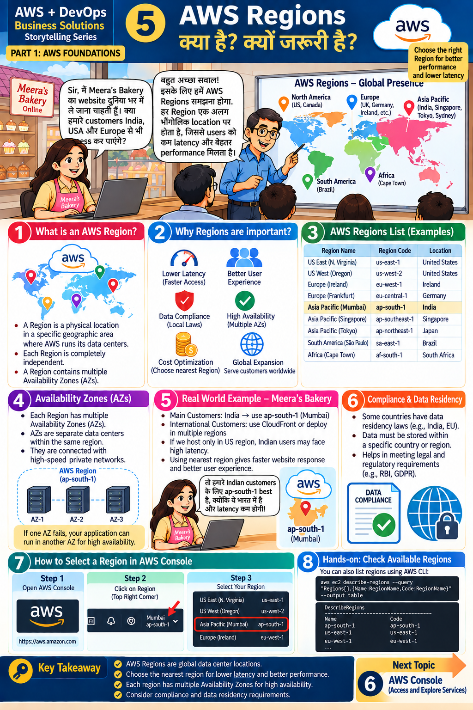

# Lesson 5 · AWS Regions — क्या है? क्यों ज़रूरी है?

`Part 1 · AWS Foundations` · ⏱ 45 min · 💰 Free · Level: Beginner



## 🎯 Learning objectives
- Explain Region vs Availability Zone.
- Choose a Region using latency, compliance, cost and service availability.
- List Regions in the console and with the CLI/Python.

## 📖 The story
Meera wants customers in **India, the USA and Europe**. *"Will they all access the site quickly?"*
Answer: *"We must understand **Regions** — each is a geographic location, which gives lower
latency and better performance."*

## 🧠 Concepts

### What is a Region? (panel 1)
A **physical location** in the world where AWS runs data centers. Each Region is **completely
independent** and contains **multiple Availability Zones**.

### Why Regions matter (panel 2)
Lower latency (faster) · better user experience · data compliance (local laws) ·
high availability · cost optimization · global expansion.

### Examples (panel 3)
| Region name | Code | Country |
|-------------|------|---------|
| US East (N. Virginia) | `us-east-1` | USA |
| US West (Oregon) | `us-west-2` | USA |
| Europe (Ireland) | `eu-west-1` | Ireland |
| Europe (Frankfurt) | `eu-central-1` | Germany |
| **Asia Pacific (Mumbai)** | **`ap-south-1`** | **India** ← our course Region |
| Asia Pacific (Singapore) | `ap-southeast-1` | Singapore |
| Asia Pacific (Tokyo) | `ap-northeast-1` | Japan |
| South America (São Paulo) | `sa-east-1` | Brazil |
| Africa (Cape Town) | `af-south-1` | South Africa |

Newer Regions can be *opt-in* (you must enable them in account settings).

### Availability Zones (panel 4)
An **AZ** is one or more separate data centers inside a Region, connected by fast private networks
(`ap-south-1a`, `1b`, `1c`). *If one AZ fails, your app can keep running in another* — that is high availability.

### Meera's decision (panel 5)
- Main customers in India → **`ap-south-1` (Mumbai)**.
- Hosting only in the US makes Indian users slow (high latency).
- International customers → use **CloudFront (CDN)** or deploy in more Regions.

### Compliance & data residency (panel 6)
Some countries/industries require data to stay in-country (examples named in the slide: India's
RBI rules, EU's GDPR). Choose the Region accordingly.

### Region checklist
1. Where are my users? (latency) · 2. Do laws restrict data location? · 3. Is the service I need available there? · 4. Prices differ per Region · 5. Keep **all lesson resources in one Region** so you can find and delete them.

## 🛠️ Hands-on

### A. Console (panel 7)
1. Sign in → top-right **Region selector** → choose **Asia Pacific (Mumbai) ap-south-1**.
2. Switch to **Europe (Ireland)** and open **EC2** — notice the dashboard is empty: **resources are per Region**. Switch back to Mumbai.

### B. AWS CLI (panel 8) *(after installing the CLI)*
```bash
aws ec2 describe-regions --query "Regions[].{Name:RegionName,Code:RegionName}" --output table
```

### C. Python (needs credentials from Lesson 8/10)
```bash
python scripts/list_regions.py
```
It prints all Regions, marks yours, and lists the Availability Zones of your Region.

## 📁 Files for this lesson
- `scripts/list_regions.py` · `.env.example` (`AWS_REGION=ap-south-1`)

## ⚠️ Common mistakes
- "I can't see my server!" → you're looking at the **wrong Region**.
- Creating resources in random Regions and forgetting them (cost).
- Mixing Regions between services (e.g. app in Mumbai, bucket in Virginia → slow and costly).

## ✅ Best practices
Choose the nearest Region · respect data residency · use multiple AZs for important systems · be consistent.

## 📝 Quiz
1. Region vs AZ?
2. Which Region code is Mumbai?
3. Why would Indian users be slow if the site is only in `us-east-1`?
4. Which service helps serve international users faster?

<details><summary>Show answers</summary>

1. Region = geographic area; AZ = separate data center(s) inside it.  2. `ap-south-1`.  3. High latency from distance.  4. CloudFront (CDN).
</details>

## 🏠 Assignment
A bakery has 70 % customers in India, 20 % in the UAE, 10 % in the UK. Propose a Region plan and explain latency, compliance and cost choices in 5 lines.

## 🔑 Key takeaway
Regions are global data-center locations. Choose the nearest one for latency, check compliance, and
use multiple AZs for availability.

**हिंदी में सार:** Region = दुनिया में AWS की भौगोलिक लोकेशन। ग्राहकों के पास का Region चुनें ताकि
latency कम हो, और data-residency नियमों का ध्यान रखें।

⬅️ [Lesson 4](04-services-and-categories.md) · ➡️ **Next:** [Lesson 6 — AWS Console](06-aws-console.md)
