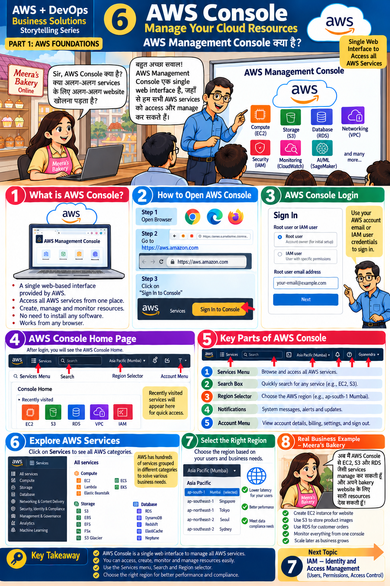

# Lesson 6 · AWS Management Console — Manage Your Cloud Resources
**AWS Management Console क्या है?**

`Part 1 · AWS Foundations` · ⏱ 60 min · 💰 Free · Level: Beginner



## 🎯 Learning objectives
- Sign in to the console and name its five key parts.
- Understand that **Region selection changes what you see**.
- Know the four ways to use AWS: Console, CLI, SDK, IaC.

## 📖 The story
*"Sir, what is the AWS Console? Do I open a different website for each service?"* —
*"No. It is a **single web interface** where we access and manage **all** AWS services."*

## 🧠 Concepts

### What is the Console? (panel 1)
A browser-based interface · access all services from one place · create, manage, monitor
resources · **nothing to install** · works from any browser.

### How to open it (panels 2–3)
1. Open a browser. 2. Go to `https://aws.amazon.com`. 3. Click **Sign In to the Console**.
Two sign-in types: **Root user** (account owner — only for initial setup) and **IAM user**
(specific permissions — use this daily, Lesson 7).

### Console home page (panel 4)
**Services menu · Search box · Region selector · Account menu**; below it *Recently visited* shortcuts (EC2, S3, RDS, VPC, IAM).

### Key parts (panel 5)
| # | Part | Use |
|---|------|-----|
| 1 | Services menu | Browse all services |
| 2 | Search box | Type "S3", "EC2"… (fastest way) |
| 3 | Region selector | Choose region, e.g. `ap-south-1` |
| 4 | Notifications | System messages, alerts, updates |
| 5 | Account menu | Account details, **billing**, settings, **Security credentials**, sign out |

### Explore services (panel 6)
Compute · Storage · Database · Networking & Content Delivery · Security, Identity & Compliance ·
Management & Governance · Analytics · Machine Learning …

### Select the right Region (panel 7) — see [Lesson 5](05-aws-regions.md)

### Meera's real example (panel 8)
From one console she can create an **EC2** instance for the website, use **S3** for product images,
use **RDS** for orders, monitor everything, and **scale later**.

### Console vs other ways to use AWS
| Way | Best for |
|-----|----------|
| **Console** (click) | Learning, exploring, one-off tasks |
| **CLI** (commands) | Quick tasks, scripts |
| **SDK** (boto3 code) | Applications (Lessons 8–11) |
| **IaC** (Terraform) | Repeatable, reviewed infrastructure (Lesson 13) |

*Tip:* the console also has **CloudShell** (a ready terminal in the browser, icon next to the search box) — a safe place to try CLI commands.

## 🛠️ Hands-on

1. Sign in (root for now; you'll switch to an IAM user in Lesson 7).
2. Set Region to **Mumbai (ap-south-1)**.
3. Use the **search box**: open **S3**, then **EC2**, then **IAM**; return to Console Home each time (click the AWS logo).
4. On Console Home click **Customize** / widgets and pin *Recently visited*.
5. Click the **account menu** → find *Billing and Cost Management* and *Security credentials*.
6. **Install the AWS CLI** if you haven't ([setup guide](../01-environment-setup.md)) and check:
   ```bash
   aws --version
   ```
7. Open **CloudShell** and run `aws s3 ls` — empty output is fine.

## 📁 Files for this lesson
None. Keep the console tab open for the next lesson.

## ⚠️ Common mistakes
- Looking for resources in the wrong Region.
- Leaving the root user signed in on shared computers.
- Clicking *Create* on services you don't understand — read first.

## ✅ Best practices
Use IAM users, not root · name and tag everything · always check the Region first · log out of shared PCs.

## 📝 Quiz
1. Name the five key parts of the console.
2. What's the fastest way to open a service?
3. Why is the Region selector important?
4. Name four ways to work with AWS.

<details><summary>Show answers</summary>

1. Services menu, Search box, Region selector, Notifications, Account menu.  2. The search box.  3. Resources exist per Region.  4. Console, CLI, SDK, IaC (Terraform).
</details>

## 🏠 Assignment
Make a one-page "Console quick tour" with screenshots of the five parts, labelled by number.

## 🔑 Key takeaway
The Console is one web interface for all AWS services. Use Services menu, Search and Region selector
effectively, and choose the Region for performance and compliance.

**हिंदी में सार:** Console एक ही web interface है जहाँ से सभी AWS services access और manage होती हैं।
Search box, Services menu और Region selector का सही उपयोग करें।

⬅️ [Lesson 5](05-aws-regions.md) · ➡️ **Next:** [Lesson 7 — IAM](07-iam.md)
