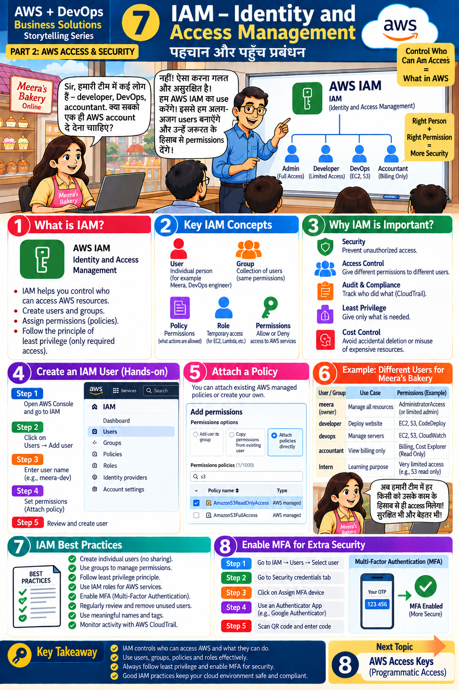

# Lesson 7 · IAM — Identity and Access Management
**पहचान और पहुँच प्रबंधन**

`Part 2 · AWS Access & Security` · ⏱ 75 min · 💰 Free · Level: Beginner → Intermediate



## 🎯 Learning objectives
- Explain **users, groups, roles, policies, permissions**.
- Apply **least privilege** and enable **MFA**.
- Create an IAM user, attach a policy, and read a policy JSON.

## 📖 The story
Meera's team grows: developer, DevOps engineer, accountant. *"Should we give everyone the same AWS
account login?"* — *"No! That is wrong and unsafe. We use **IAM**: separate users, each with the
permissions they need."*

## 🧠 Concepts

### What is IAM? (panel 1)
Service that controls **who can access which AWS resources**. You create users and groups,
assign permissions (policies), and follow **least privilege** (only what's required).

### Key IAM concepts (panel 2)
| Concept | Meaning | Example |
|---------|---------|---------|
| **User** | One person or application identity | `meera-dev` |
| **Group** | Collection of users sharing permissions | `developers` |
| **Policy** | JSON document of allowed/denied actions | `AmazonS3ReadOnlyAccess` |
| **Role** | Temporary permissions for AWS services (EC2, Lambda) or other accounts | EC2 role that reads S3 |
| **Permission** | Allow or Deny on a service/action | `s3:GetObject` |

### Why IAM matters (panel 3)
Security (block unauthorized access) · access control (different people, different rights) ·
audit & compliance (**CloudTrail** records who did what) · **least privilege** · cost control
(avoid accidental deletion of expensive resources).

### Anatomy of a policy
```json
{
  "Version": "2012-10-17",
  "Statement": [{
    "Effect": "Allow",                         // Allow or Deny
    "Action": ["s3:GetObject"],                // what can be done
    "Resource": "arn:aws:s3:::my-bucket/*"     // on which resources
  }]
}
```
Rule of thumb: **everything is denied unless explicitly allowed; an explicit Deny always wins.**

### Example: different users for Meera's Bakery (panel 6)
| User/Group | Use case | Permissions (example) |
|------------|----------|------------------------|
| meera (owner) | Manage all resources | Administrator (or limited admin) |
| developer | Deploy website | EC2, S3, CodeDeploy |
| devops | Manage servers | EC2, S3, CloudWatch |
| accountant | View billing | Billing, Cost Explorer (read-only) |
| intern | Learning | Very limited (e.g. S3 read-only) |

> 💡 For the accountant to see billing, the account owner must first enable **"IAM user and role access to Billing information"** (Account settings, as root).

## 🛠️ Hands-on — Create an IAM user (panels 4–5)

### Part A — Console
1. Sign in → search **IAM** → open it.
2. **User groups ▸ Create group** → name `developers` → attach policy **AmazonS3ReadOnlyAccess** → *Create*.
3. **Users ▸ Create user** (panel 4, steps 1–5):
   1. Open IAM → *Users → Create user*.
   2. **User name:** `meera-dev`. Tick *Provide user access to the AWS Management Console* if she needs the console, choose a custom password.
   3. **Set permissions:** choose **Add user to group** → `developers` (or *Attach policies directly* as in the slide).
   4. Review → **Create user**. Download/save the sign-in URL and password securely.
4. Sign in as `meera-dev` in a private window; open S3 (list works) and try to create a bucket → **Access Denied**. That proves least privilege.
5. **Enable MFA for the user** (panel 8 of the infographic): *IAM ▸ Users ▸ meera-dev ▸ Security credentials ▸ Assign MFA device ▸ Authenticator app*.
6. Create an **admin IAM user for yourself** (group `admins` with `AdministratorAccess`), sign in with it, and **stop using root**.

### Part B — Same thing with the CLI
Open `scripts/iam_setup.sh` and run its commands **one at a time**. It also contains the cleanup commands.

### Part C — Write your own least-privilege policy
Open `iam/s3-bakery-images-policy.json`, replace `BUCKET_NAME`, then in IAM ▸ Policies ▸ Create policy ▸ JSON, paste it. Attach it to the `developers` group instead of the broad managed policy.

### Part D — Roles (preview)
A **role** has no password/keys. When EC2 *assumes* a role it receives temporary credentials. Look at `iam/ec2-trust-policy.json` — the "trust policy" says *who may assume the role*. Terraform builds one in Lesson 13.

## 📁 Files for this lesson
`scripts/iam_setup.sh` · `iam/s3-bakery-images-policy.json` · `iam/ec2-trust-policy.json` · `scripts/cloudtrail_lookup.py` (see who did what)

## ⚠️ Common mistakes
- Using **root** for everyday work or creating root access keys.
- Attaching `AdministratorAccess` to everyone "to make it work".
- Sharing one IAM user among several people.
- Leaving unused users and old keys active.
- Forgetting that policy changes can take a few seconds to apply.

## ✅ Best practices (panel 7)
Individual users (no sharing) · groups to manage permissions · least privilege · **roles for AWS services** · **MFA** · regularly review/remove unused users · meaningful names and tags · monitor with **CloudTrail**.

## 📝 Quiz
1. User vs group vs role?
2. What does least privilege mean?
3. If a policy has both Allow and Deny for the same action, what happens?
4. Why is the root user dangerous for daily use?
5. Which service records who did what?

<details><summary>Show answers</summary>

1. User = one identity; group = set of users; role = temporary identity assumed by services/accounts.  2. Only the permissions needed, nothing more.  3. Deny wins.  4. Unlimited power; if stolen, the whole account is lost.  5. CloudTrail.
</details>

## 🏠 Assignment
Create groups `developers`, `devops`, `accounts` and one user in each with suitable managed policies (S3 read-only, EC2 + CloudWatch read-only, Billing view). Test each user and write what they can and cannot do. Delete everything afterwards.

## 🔑 Key takeaway
IAM controls **who can access AWS and what they can do**. Use users, groups, policies and roles
effectively; always follow least privilege and enable MFA.

**हिंदी में सार:** IAM तय करता है कि कौन AWS में क्या कर सकता है। हर व्यक्ति का अलग user बनाएँ, groups से
permissions दें, सिर्फ़ ज़रूरी अधिकार दें और MFA चालू रखें।

⬅️ [Lesson 6](06-aws-console.md) · ➡️ **Next:** [Lesson 8 — Access Keys](08-access-keys.md)
