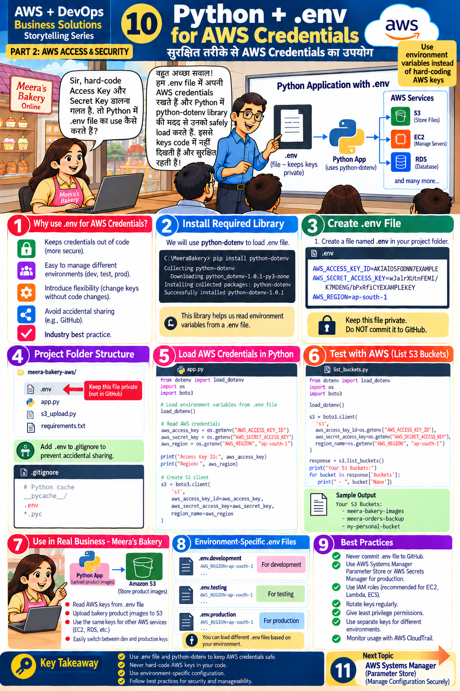

# Lesson 10 · Python + .env for AWS Credentials
**सुरक्षित तरीके से AWS Credentials का उपयोग**

`Part 2 · AWS Access & Security` · ⏱ 60 min · 💰 Free · Level: Intermediate



## 🎯 Learning objectives
- Keep credentials in a `.env` file and load them with **python-dotenv**.
- Prevent accidental upload with `.gitignore`.
- Use separate settings for development / testing / production.

## 📖 The story
Meera: *"Hard-coding keys is wrong. So how do I use a `.env` file?"* Teacher: *"We keep our AWS
credentials in a `.env` file and load them with **python-dotenv**. The keys don't appear in code and stay safe."*

## 🧠 Concepts

### Why .env? (panel 1)
Keeps credentials **out of code** · easy to manage dev/test/prod · change keys **without code changes** · avoids accidental sharing · industry best practice.

### How it works
```
.env  ──(python-dotenv)──►  environment variables  ──(boto3 reads automatically)──►  AWS
```
boto3 automatically reads `AWS_ACCESS_KEY_ID`, `AWS_SECRET_ACCESS_KEY`, `AWS_SESSION_TOKEN`, `AWS_DEFAULT_REGION`/`AWS_REGION` from the environment — so after `load_dotenv()` you don't even need to pass keys to `boto3.client()`.

## 🛠️ Hands-on (panels 2–6)

### Step 1 — Folder structure (panel 4)
```
aws-devops-meeras-bakery/
├── .env             ← secrets (NOT in Git)
├── .env.example     ← template (safe, in Git)
├── .gitignore       ← lists .env
├── app/config.py    ← loads settings
└── scripts/         ← list_buckets.py, s3_upload.py
```

### Step 2 — Install the library (panel 2)
```bash
pip install python-dotenv          # already in requirements.txt
```

### Step 3 — Create `.env` (panel 3)
```bash
cp .env.example .env               # Windows: Copy-Item .env.example .env
```
Edit `.env`:
```ini
AWS_ACCESS_KEY_ID=<your key id from Lesson 8>
AWS_SECRET_ACCESS_KEY=<your secret>
AWS_REGION=ap-south-1
S3_BUCKET=<your-bucket-name>
```
> 🔒 **Keep this file private. Do NOT commit it to GitHub.** No quotes and no spaces around `=` are needed.

### Step 4 — Protect it with .gitignore (panel 4)
Our `.gitignore` already has:
```gitignore
.env
.env.*
!.env.example
```
Verify (inside a Git repo): `git status` must **not** list `.env`. Test: `git check-ignore -v .env` prints the rule that ignores it.
If you ever committed it by mistake: `git rm --cached .env` — **and rotate the keys** (Lesson 9).

### Step 5 — Load credentials in Python (panel 5)
```python
from dotenv import load_dotenv
import os, boto3

load_dotenv()                                    # reads .env into os.environ

aws_region = os.getenv("AWS_REGION", "ap-south-1")
s3 = boto3.client("s3", region_name=aws_region)  # keys picked up automatically
```
Never `print()` the secret key. (The slide prints the Access Key ID for learning; in real apps avoid even that.)

### Step 6 — Test with AWS (panel 6)
```bash
python scripts/list_buckets.py
```
Expected: `Your S3 Buckets:` and bucket names. Also run `python scripts/check_identity.py`.

### Step 7 — Environment-specific files (panel 8)
| File | For | `APP_ENV` |
|------|-----|-----------|
| `.env.development` | development | `dev` |
| `.env.testing` | testing | `test` |
| `.env.production` | production | `prod` |

```bash
cp .env.development.example .env.development
APP_ENV=dev python -m uvicorn app.main:app           # macOS/Linux
$env:APP_ENV="dev"; python -m uvicorn app.main:app   # PowerShell
```
`app/config.py` loads `.env.<environment>` first and `.env` second; **real environment variables always win** (that's how Docker/EC2/GitHub Actions override settings).

### Step 8 — Use it in the real app (panel 7)
1. Put a cake photo in the project folder.
2. `python scripts/s3_upload.py cake.png` (bucket comes from `.env`).
3. Start the API: `python -m uvicorn app.main:app --reload` → open `http://127.0.0.1:8000/docs` → **POST /products/upload** → *Try it out* → choose a file → Execute.
4. **GET /products** now lists the image. **GET /config** shows settings *without* secrets.

## 📁 Files for this lesson
`.env.example` · `.env.development.example` · `.env.testing.example` · `.env.production.example` · `.gitignore` · `app/config.py` · `app/aws_clients.py` · `scripts/list_buckets.py` · `scripts/s3_upload.py` · `tests/test_app.py`

## ⚠️ Common mistakes & fixes
| Symptom | Fix |
|---------|-----|
| Variables are `None` | `.env` is not in the *current working directory*; run from the project root, or use `load_dotenv(find_dotenv())` |
| Old value still used | A real environment variable overrides `.env`; unset it (or use `load_dotenv(override=True)`) |
| `.env` appears in `git status` | It was committed earlier: `git rm --cached .env`; rotate keys |
| Spaces/quotes break values | Write `KEY=value` (no spaces around `=`) |
| Works locally, not on server | `.env` is not deployed (on purpose!). Use an IAM role/SSM there (Lesson 11, 13) |

## ✅ Best practices (panel 9)
Never commit `.env` · use Parameter Store or Secrets Manager in production · IAM roles for EC2/ECS/Lambda · rotate keys · least privilege · different keys per environment · monitor with CloudTrail · commit a safe `.env.example`.

## 📝 Quiz
1. What does `load_dotenv()` do?
2. Which file stops `.env` reaching GitHub?
3. Does boto3 need the keys passed in code after `load_dotenv()`?
4. Which wins: real environment variable or `.env` value?
5. Why commit `.env.example`?

<details><summary>Show answers</summary>

1. Reads `.env` and sets environment variables.  2. `.gitignore`.  3. No, it reads them from the environment.  4. The real environment variable (unless `override=True`).  5. It documents which settings are needed, without secrets.
</details>

## 🏠 Assignment
Add a new setting `DB_HOST` to `.env.example`, load it in `app/config.py`, expose it (non-secret!) in `/config`, and update a test. Then create `.env.testing` with a different bucket and prove `APP_ENV=test` uses it.

## 🔑 Key takeaway
Use `.env` + `python-dotenv` to keep AWS credentials safe and out of code; never hard-code keys;
use environment-specific files and follow security best practices.

**हिंदी में सार:** Keys को `.env` में रखें, `python-dotenv` से load करें और `.gitignore` में `.env` जोड़ें ताकि GitHub पर न जाए।
Dev/Test/Prod के लिए अलग `.env` files रखें।

⬅️ [Lesson 9](09-secret-key-mistake.md) · ➡️ **Next:** [Lesson 11 — SSM Parameter Store](11-ssm-parameter-store.md)
