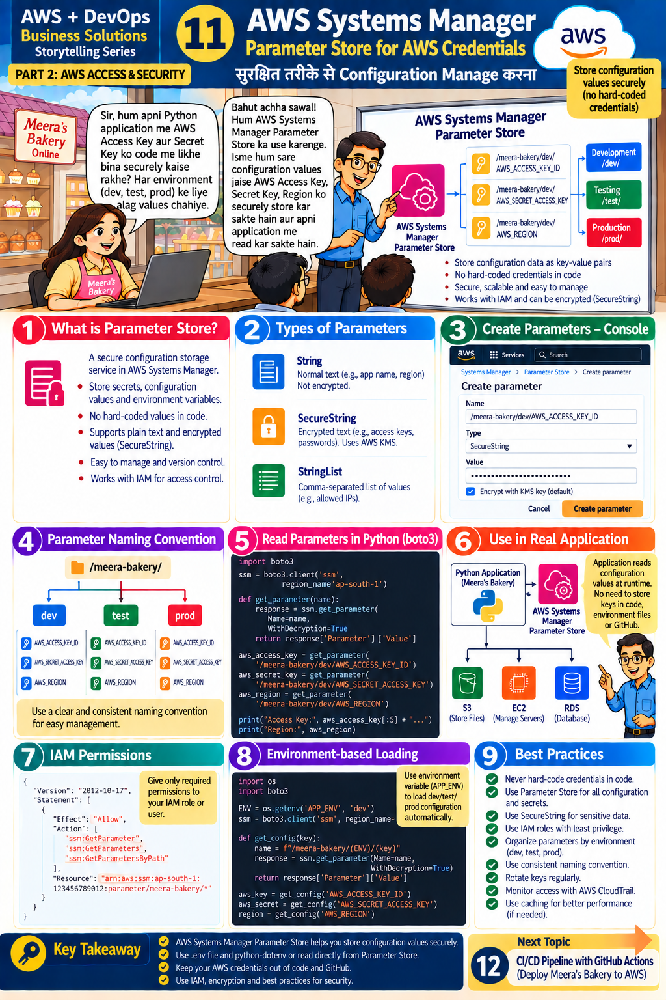

# Lesson 11 · AWS Systems Manager — Parameter Store
**सुरक्षित तरीके से Configuration Manage करना**

`Part 2 · AWS Access & Security` · ⏱ 75 min · 💰 Free (standard parameters) · Level: Intermediate



## 🎯 Learning objectives
- Store configuration and secrets centrally in **Parameter Store**.
- Choose between **String, SecureString, StringList**.
- Read parameters from Python with boto3 and load per-environment settings.
- Grant least-privilege IAM permissions for reading parameters.

## 📖 The story
Meera: *"How do I keep config values securely? Different environments (dev, test, prod) need different values."*
Teacher: *"We'll use **AWS Systems Manager Parameter Store**. We store config values as key-value pairs
and the application reads them at runtime."*

## 🧠 Concepts

### What is Parameter Store? (panel 1)
A secure configuration-storage service inside Systems Manager. No hard-coded values in code · supports plain text and **encrypted** values · versioned · controlled by IAM.

### Parameter types (panel 2)
| Type | Use | Encrypted? |
|------|-----|-----------|
| **String** | normal text (app name, region) | No |
| **SecureString** | passwords, keys, tokens | **Yes** (AWS KMS) |
| **StringList** | comma-separated values (allowed IPs) | No |

### Naming convention (panel 4) — a folder-like hierarchy
```
/meera-bakery/
   dev/    AWS_REGION   S3_BUCKET   DB_PASSWORD
   test/   AWS_REGION   S3_BUCKET   DB_PASSWORD
   prod/   AWS_REGION   S3_BUCKET   DB_PASSWORD
```
Hierarchy lets you read a whole environment with one call (`get_parameters_by_path`) and write IAM policies like `parameter/meera-bakery/prod/*`.

### Important design note
The slide stores AWS access keys as parameters to teach the mechanics. In production, an app on EC2/ECS/Lambda uses an **IAM role** to read Parameter Store, so **no keys are stored at all**; Parameter Store should hold *settings and application secrets* (bucket names, DB passwords, API tokens). Otherwise you'd need keys to fetch keys.

## 🛠️ Hands-on

### Step 1 — Create parameters in the console (panel 3)
1. Console → **Systems Manager ▸ Parameter Store ▸ Create parameter**.
2. **Name:** `/meera-bakery/dev/AWS_REGION` · **Type:** String · **Value:** `ap-south-1` → Create.
3. **Name:** `/meera-bakery/dev/S3_BUCKET` · String · your bucket name.
4. **Name:** `/meera-bakery/dev/DB_PASSWORD` · **Type: SecureString** · KMS key: *alias/aws/ssm (default)* · value `MyPracticePassw0rd!` → Create.
5. Open the SecureString parameter: the value is hidden until you click **Show decrypted value** (needs permission).

### Step 2 — Create the same with Python
```bash
python scripts/ssm_put_parameters.py dev <your-bucket-name>
# For a secret, pass it via the environment, never on the command line or in code:
#   PowerShell:  $env:DB_PASSWORD="..." ; python scripts/ssm_put_parameters.py dev <bucket>
```

### Step 3 — Read parameters (panel 5)
```bash
python scripts/ssm_get_parameters.py dev
```
Look at the code (`ssm.get_parameter(Name=..., WithDecryption=True)` / `get_parameters_by_path`). Notice `SecureString` values are decrypted **only** because of `WithDecryption=True` + IAM/KMS permission.

### Step 4 — Make the real app use it (panels 6 & 8)
In `.env` set:
```ini
USE_PARAMETER_STORE=true
APP_ENV=dev
```
Start the API and open **GET /config** → `"parameter_store": true`; **GET /products** uses the bucket from Parameter Store.
Switch `APP_ENV=prod` after creating `/meera-bakery/prod/...` parameters → the *same code* picks different values (panel 8: environment-based loading). The logic is in `app/config.py` (`_read_from_parameter_store`).

### Step 5 — IAM permissions (panel 7)
Open `iam/ssm-read-policy.json`:
```json
"Action": ["ssm:GetParameter", "ssm:GetParameters", "ssm:GetParametersByPath"],
"Resource": "arn:aws:ssm:ap-south-1:ACCOUNT_ID:parameter/meera-bakery/*"
```
Replace `ACCOUNT_ID` (`aws sts get-caller-identity`) and create the policy. Attach it to a test user; confirm that user can read `/meera-bakery/*` but not `/other-app/*`. For SecureString with a *custom* KMS key you'd also need `kms:Decrypt` on that key.

### Step 6 — With Terraform
`terraform/main.tf` creates `/meera-bakery/<env>/AWS_REGION` and `/S3_BUCKET` automatically (Lesson 13).

### Step 7 — Cleanup
```bash
aws ssm delete-parameter --name /meera-bakery/dev/DB_PASSWORD
aws ssm delete-parameters --names /meera-bakery/dev/AWS_REGION /meera-bakery/dev/S3_BUCKET
```

## 📁 Files for this lesson
`scripts/ssm_put_parameters.py` · `scripts/ssm_get_parameters.py` · `app/config.py` · `iam/ssm-read-policy.json` · `terraform/main.tf` · `tests/test_app.py::test_settings_from_parameter_store`

## ⚠️ Common mistakes & fixes
| Symptom | Fix |
|---------|-----|
| `ParameterNotFound` | Wrong name/Region/environment; names are **case-sensitive** and start with `/` |
| `AccessDeniedException` | IAM policy missing `ssm:Get*` for that path (or `kms:Decrypt`) |
| Value looks like gibberish | Add `WithDecryption=True` |
| Slow / throttled | Read once at startup and **cache** (`@lru_cache`, as in `get_settings`) |
| Cost surprise | *Standard* parameters are free; *Advanced* tier and API-throughput increases are paid |

## ✅ Best practices (panel 9)
Never hard-code credentials · Parameter Store for all configuration · **SecureString** for sensitive data · IAM roles with least privilege · organise by environment · consistent naming · rotate keys · monitor access with CloudTrail · cache for performance.
For automatic rotation of database passwords look at **AWS Secrets Manager**.

## 📝 Quiz
1. Which parameter type encrypts values?
2. Why use `/meera-bakery/dev/...` style names?
3. Which boto3 call reads a whole folder of parameters?
4. What do you pass to get a decrypted SecureString?
5. Why cache parameters in the app?

<details><summary>Show answers</summary>

1. SecureString.  2. Environment separation, easy bulk reads, easy IAM policies.  3. `get_parameters_by_path`.  4. `WithDecryption=True` (and have permission).  5. Fewer API calls → faster and cheaper, avoids throttling.
</details>

## 🏠 Assignment
Create `/meera-bakery/test/*` parameters, then run the API with `APP_ENV=test` and prove it loads the test bucket. Write an IAM policy that lets the *test* app read only `/meera-bakery/test/*`.

## 🔑 Key takeaway
Parameter Store keeps configuration values secure. Use `.env` for local work or read directly from
Parameter Store; keep credentials out of code and GitHub; use IAM, encryption and best practices.

**हिंदी में सार:** Parameter Store में config और secrets सुरक्षित रखें। `/app/env/NAME` जैसा naming रखें,
secrets के लिए SecureString चुनें और IAM से केवल ज़रूरी access दें।

⬅️ [Lesson 10](10-python-dotenv.md) · ➡️ **Next:** [Lesson 12 — GitHub Actions CI/CD](12-github-actions-cicd.md)
