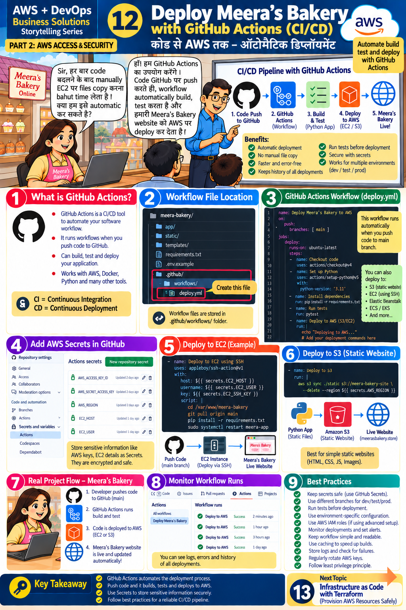

# Lesson 12 · Deploy Meera's Bakery with GitHub Actions (CI/CD)
**कोड से AWS तक — ऑटोमैटिक डिप्लॉयमेंट**

`Part 2 · AWS Access & Security` · ⏱ 90 min · 💰 Free (public repo; small AWS cost if you deploy) · Level: Intermediate



## 🎯 Learning objectives
- Explain **CI** and **CD**, and what a workflow, job and step are.
- Write a workflow that tests code and deploys it to AWS on every push.
- Store AWS credentials safely as **GitHub Secrets**.
- Read workflow run logs to find failures.

## 📖 The story
Meera: *"Every time I change code, copying files to EC2 takes too long. Can we automate this?"*
Teacher: *"Yes — **GitHub Actions**. When code is pushed to GitHub, a workflow automatically builds,
tests and deploys Meera's Bakery to AWS."*

## 🧠 Concepts

### CI/CD pipeline (top banner)
`1. Code push to GitHub` → `2. GitHub Actions (workflow)` → `3. Build & Test (Python app)` → `4. Deploy to AWS (EC2 / S3)` → `5. Meera's Bakery live!`

**Benefits:** automatic deployment · no manual file copy · faster and error-free · history of all deployments · tests before deployment · secure with secrets · works for dev/test/prod.

- **CI** = *Continuous Integration* — every push is automatically built and tested.
- **CD** = *Continuous Deployment/Delivery* — passing code is automatically released.

### Anatomy of a workflow (panel 3)
```yaml
name: Deploy Meera's Bakery to AWS        # shown in the Actions tab
on:                                       # WHEN it runs
  push:
    branches: [main]
jobs:                                     # WHAT runs
  deploy:
    runs-on: ubuntu-latest                # on which machine
    steps:                                # in order
      - uses: actions/checkout@v4         # a ready-made action
      - run: pytest                       # a shell command
```
Workflow files **must** live in `.github/workflows/` (panel 2). `secrets.NAME` reads an encrypted secret.

### GitHub Secrets (panel 4)
Repository **Settings ▸ Secrets and variables ▸ Actions ▸ New repository secret**. Values are encrypted, masked in logs and never shown again.

| Secret | Value |
|--------|-------|
| `AWS_ACCESS_KEY_ID` | key of a **dedicated, least-privilege** IAM user (not yours, not root) |
| `AWS_SECRET_ACCESS_KEY` | its secret |
| `AWS_REGION` | `ap-south-1` |
| `STATIC_BUCKET` | S3 bucket for the website |
| `EC2_HOST`, `EC2_USER`, `EC2_SSH_KEY` | only for the EC2/SSH method |

### Deploy targets (panels 5 & 6)
- **S3 static website** → `aws s3 sync ./static s3://BUCKET --delete` (best for HTML/CSS/JS/images).
- **EC2 via SSH** → SSH in, `git pull`, install, restart the service.
- Also possible: Elastic Beanstalk, ECS/EKS (Lesson 14 uses containers).

## 🛠️ Hands-on — step by step

### Step 1 — Put the project on GitHub
```bash
git init
git add .
git status                       # CHECK: .env must NOT be listed!
git commit -m "Meera's Bakery: first commit"
git branch -M main
# create an EMPTY repo on github.com first (no README), then:
git remote add origin https://github.com/<your-user>/meera-bakery.git
git push -u origin main
```

### Step 2 — Watch CI run (no AWS needed)
Open the repo → **Actions** tab → *CI - Test Meera's Bakery* (from `.github/workflows/ci.yml`) runs tests automatically. Green ✔ = passed. Click a run → job → step to read logs (panel 8).

### Step 3 — Create a dedicated deploy user (least privilege)
1. IAM ▸ Users ▸ Create user `github-deployer` (no console access).
2. Attach a policy based on `iam/github-actions-deploy-policy.json` (replace the placeholders).
3. Create an access key (use case *Application running outside AWS*).

### Step 4 — Create the target
Fastest path: create an S3 bucket in the console, or use Terraform (Lesson 13, with `-var enable_public_static_site=true`).
Static website hosting needs the bucket policy to allow public read — **use only for this demo** and delete afterwards (production sites should use CloudFront).

### Step 5 — Add secrets and the safety switch
Add the secrets above, then **Settings ▸ Secrets and variables ▸ Actions ▸ Variables ▸ New variable** → `DEPLOY_ENABLED` = `true`.
(Our workflows skip deploy jobs unless this variable is `true`, so forks and beginners can't accidentally deploy.)

### Step 6 — Run the deployment
Edit `static/index.html` (change the heading), then:
```bash
git add static/index.html
git commit -m "Update homepage"
git push
```
Actions → **Deploy Meera's Bakery to AWS** → `test` then `deploy-static` ✔. Check the bucket in S3 — the file is updated. You can also run it by hand: Actions ▸ workflow ▸ **Run workflow** (`workflow_dispatch`).

### Step 7 — Try the EC2/SSH method
See `.github/workflows/examples/deploy-ec2-ssh.yml` (panel 5). Copy it into `.github/workflows/` only after you have an EC2 instance, a systemd service and the three EC2 secrets.

### Step 8 — Break it on purpose (learn debugging)
Make a test fail (e.g. change `assert r.status_code == 200` to `201`), push, and watch the pipeline **stop before deployment**. Fix and push again. That is exactly why tests run first.

## 📁 Files for this lesson
`.github/workflows/ci.yml` · `.github/workflows/deploy.yml` · `.github/workflows/examples/deploy-ec2-ssh.yml` · `static/index.html` · `iam/github-actions-deploy-policy.json`

## ⚠️ Common mistakes & fixes
| Symptom | Fix |
|---------|-----|
| Workflow doesn't start | File not in `.github/workflows/`, YAML indentation wrong, or branch name differs from `main` |
| `Credentials could not be loaded` | Secret name typo or secret missing |
| `AccessDenied` on S3 sync | Deployer IAM policy lacks `s3:PutObject/DeleteObject/ListBucket` for that bucket |
| Deploy job skipped | `DEPLOY_ENABLED` variable isn't `true` |
| `.env` or key committed | Rotate immediately — Lesson 9 |
| Website 403 | Bucket not public / no `index.html` / website hosting disabled |

## ✅ Best practices (panel 9)
Keep secrets safe (GitHub Secrets) · separate branches for dev/test/prod · **run tests before deployment** · environment-specific config · IAM roles with least privilege · monitor deployments and set alerts · keep workflows simple · cache dependencies (`cache: pip`) · check logs · rotate AWS keys · least privilege.
*Advanced:* replace long-lived keys with **OpenID Connect (OIDC)** so GitHub gets temporary credentials from an IAM role — no stored secrets (see `aws-actions/configure-aws-credentials` docs).

## 📝 Quiz
1. What do CI and CD stand for?
2. Where must workflow files live?
3. How do you keep AWS keys out of the YAML?
4. Why run tests before deploy?
5. What triggers `deploy.yml`?

<details><summary>Show answers</summary>

1. Continuous Integration / Continuous Deployment.  2. `.github/workflows/`.  3. GitHub Secrets (`${{ secrets.NAME }}`).  4. To stop broken code reaching users.  5. A push to `main` that changes `static/**` (or a manual run).
</details>

## 🏠 Assignment
Add a step that prints the commit message and time of deployment, and a second job that sends you a notification (e.g. GitHub e-mail on failure is automatic — read about `if: failure()`). Document your pipeline with a diagram.

## 🔑 Key takeaway
GitHub Actions automates the deployment process. Push code and it builds, tests and deploys to AWS.
Use Secrets for sensitive information and follow CI/CD best practices.

**हिंदी में सार:** Code push करते ही GitHub Actions अपने-आप build, test और AWS पर deploy करता है। AWS keys हमेशा
GitHub Secrets में रखें, YAML में कभी नहीं।

⬅️ [Lesson 11](11-ssm-parameter-store.md) · ➡️ **Next:** [Lesson 13 — Terraform](13-terraform.md)
