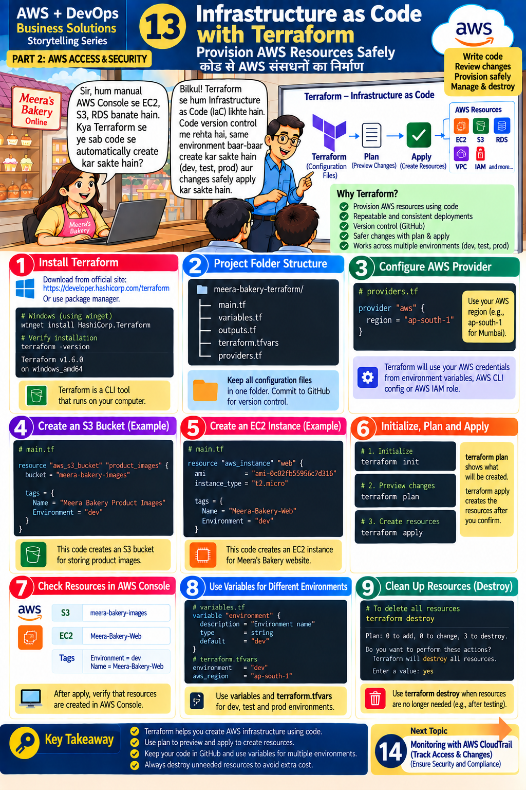
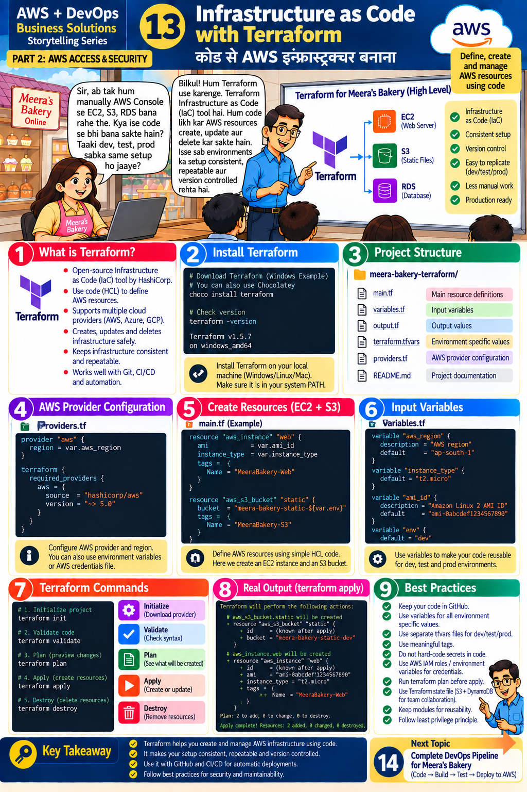

# Lesson 13 · Infrastructure as Code with Terraform
**कोड से AWS इंफ्रास्ट्रक्चर बनाना**

`Part 2 · AWS Access & Security` · ⏱ 120 min · 💰 Small — **always `terraform destroy`** · Level: Intermediate

This lesson has **two infographics** (version A and version B). They teach the same ideas with slightly different examples; this document merges both.

| Version A (Provision AWS Resources Safely) | Version B (Define, create and manage AWS resources) |
|:---:|:---:|
|  |  |

## 🎯 Learning objectives
- Explain **Infrastructure as Code (IaC)** and why teams use it.
- Install Terraform and understand the folder structure of a project.
- Write provider, resource and variable blocks.
- Run the cycle `init → validate → plan → apply → destroy`.
- Use variables / `tfvars` for dev, test and prod.

## 📖 The story
Meera: *"So far we created EC2, S3 and RDS manually from the console. Can Terraform create all of this from code, so dev, test and prod get the same setup?"*
Teacher: *"Yes. With Terraform we write **Infrastructure as Code**. Code is version-controlled, environments can be re-created again and again, and changes are applied safely."*

## 🧠 Concepts

### Why Terraform? (A: "Why Terraform?")
Provision resources with code · repeatable and consistent · version control (GitHub) · **safer changes with plan & apply** · works across environments · less manual work · production ready · supports many clouds (AWS, Azure, GCP).

### The workflow
```
Configuration files (.tf) ──► terraform plan (preview) ──► terraform apply (create) ──► AWS resources
```
Terraform keeps a **state file** (`terraform.tfstate`) = its memory of what exists. Never edit it by hand; **never commit it** (it can contain secrets — it's in `.gitignore`). Teams store state remotely (an S3 backend with locking).

### Project structure (A panel 2 / B panel 3)
| File | Purpose |
|------|---------|
| `main.tf` | Main resource definitions |
| `variables.tf` | Input variables |
| `outputs.tf` (B calls it `output.tf`) | Output values |
| `terraform.tfvars` | Environment-specific values |
| `providers.tf` | AWS provider configuration |
| `README.md` | Project documentation |

All of these exist in our `terraform/` folder.

### HCL building blocks
```hcl
provider "aws" { region = var.aws_region }              # which cloud / region

resource "aws_s3_bucket" "images" {                     # resource "TYPE" "LOCAL_NAME"
  bucket = "meera-bakery-images-abc123"
  tags   = { Name = "Meera Bakery Product Images", Environment = "dev" }
}

variable "environment" { type = string, default = "dev" }   # input
output "bucket" { value = aws_s3_bucket.images.bucket }     # output
```
References like `aws_s3_bucket.images.id` create **dependencies** — Terraform orders the work automatically.

## 🛠️ Hands-on — step by step

### Step 1 — Install & verify (A panel 1 / B panel 2)
Windows: `winget install HashiCorp.Terraform` (or `choco install terraform`, or download from the official HashiCorp site). Then:
```bash
terraform -version
```
Any recent version ≥ 1.5 works (the slides show 1.6.0 and 1.5.7).

### Step 2 — Credentials
Terraform uses the same credential chain as boto3: `aws configure` profile, or `AWS_ACCESS_KEY_ID`/`AWS_SECRET_ACCESS_KEY` environment variables, or an IAM role. Check: `aws sts get-caller-identity`. Use an IAM user that may create EC2, S3, IAM roles, ECR, SSM, CloudWatch, SNS (for learning an admin user is simplest — use a **practice account**).

### Step 3 — Read the code first
Open `terraform/` in VS Code (install the HashiCorp Terraform extension) and read in this order: `providers.tf` → `variables.tf` → `main.tf` → `outputs.tf`. Find: the S3 bucket (A panel 4), the EC2 instance (A panel 5), the variables (B panel 6).

> **Note on AMI IDs.** The slides hard-code an `ami-...` ID. AMI IDs are **different in every Region and become outdated**, so our code looks up the latest Amazon Linux 2023 AMI from an official AWS public SSM parameter. Same idea, no broken IDs.

### Step 4 — Initialize → Validate → Plan (A panel 6 / B panel 7)
```bash
cd terraform
terraform init                                   # downloads the AWS + random providers
terraform fmt                                    # formats code
terraform validate                               # syntax check → "Success!"
terraform plan -var-file=envs/dev.tfvars         # preview; nothing is created yet
```
Read the plan: `+` create, `~` change, `-` destroy. At the end: `Plan: N to add, 0 to change, 0 to destroy.`

### Step 5 — Apply (create resources)
```bash
terraform apply -var-file=envs/dev.tfvars        # type: yes
terraform output                                 # shows IPs and bucket names
```

### Step 6 — Check in the AWS Console (A panel 7)
Verify: **S3** buckets named `meera-bakery-dev-images-xxxxxx` / `-static-`, **EC2** instance `Meera-Bakery-Web`, **IAM** role, **ECR** repo, **Parameter Store** `/meera-bakery/dev/...`, **CloudWatch** alarm and dashboard. Open a resource → **Tags** shows `Environment = dev`, `ManagedBy = terraform`.

### Step 7 — Change something (the real power)
1. In `variables.tf` change the default `instance_type` to `t3.micro` (or run `terraform plan -var instance_type=t3.micro`).
2. `terraform plan` → it shows exactly which resource will be replaced/changed and why.
3. Apply only if you agree. This preview is the "safe change" promise.

### Step 8 — Multiple environments (A panel 8 / B panel 6)
```bash
terraform plan -var-file=envs/prod.tfvars        # same code, different values
```
For truly separate dev/test/prod you'd use separate **workspaces** or separate state backends/folders so one `apply` never touches another environment.

### Step 9 — Use the outputs
```bash
terraform output images_bucket       # put into .env as S3_BUCKET and test: python scripts/list_buckets.py
terraform output web_instance_id     # python scripts/cw_create_alarm.py <id> you@example.com   (Lesson 15)
terraform output ecr_repository_url  # GitHub secret ECR_URI (Lesson 14)
```

### Step 10 — Clean up (A panel 9) 🧹
```bash
terraform destroy -var-file=envs/dev.tfvars      # type: yes
```
"Plan: 0 to add, 0 to change, N to destroy." Use it whenever resources are no longer needed — **unused resources cost money**. (Do this before Lessons 14/15 only if you finish those first; they reuse these resources.)

## 📁 Files for this lesson
`terraform/providers.tf` · `variables.tf` · `main.tf` · `monitoring.tf` · `outputs.tf` · `terraform.tfvars` · `envs/*.tfvars` · `user_data.sh.tpl` · `terraform/README.md`

## ⚠️ Common mistakes & fixes
| Symptom | Fix |
|---------|-----|
| `terraform: command not found` | Reopen the terminal / add to PATH |
| `BucketAlreadyExists` | Bucket names are global — keep the `random_id` suffix |
| `UnauthorizedOperation` / `AccessDenied` | The IAM user lacks permission for that service |
| `InvalidAMIID.NotFound` | Hard-coded AMI from another Region — use the SSM lookup |
| `InstanceType not eligible` / capacity error | Pick another type available in your Region/account |
| State lock / "already exists" | Resource created outside Terraform — `terraform import` or delete it |
| Forgot to destroy | Check Billing; delete resources; set budgets (Lesson 2) |
| Committed `terraform.tfstate` | Remove from Git; state may hold secrets — rotate them |

## ✅ Best practices (A/B panel 9)
Keep code in GitHub · variables for environment values · separate `tfvars` per environment · meaningful tags · **no secrets in code** · IAM roles/env variables for credentials · always `plan` before `apply` · remote state (S3 + locking) for teams · modules for reuse · least privilege · destroy unneeded resources.

## 📝 Quiz
1. What is IaC?
2. What does `terraform plan` do that `apply` doesn't?
3. Which file stores input values per environment?
4. Why not hard-code an AMI ID?
5. Why is the state file sensitive?

<details><summary>Show answers</summary>

1. Defining/managing infrastructure with code files.  2. Shows what would change without changing anything.  3. `terraform.tfvars` / `envs/*.tfvars`.  4. AMIs differ per Region and expire.  5. It records resource details and may contain secrets.
</details>

## 🏠 Assignment
Add a new resource: an `aws_s3_bucket` for backups with versioning enabled (`aws_s3_bucket_versioning`), an output for its name, and a tag `Purpose = backup`. Run `fmt`, `validate`, `plan`, `apply`, verify, then `destroy`.

## 🔑 Key takeaway
Terraform creates and manages AWS infrastructure with code: consistent and repeatable, version-controlled,
safe with `plan` before `apply`, and cheap when you destroy what you don't need.

**हिंदी में सार:** Terraform से हम code लिखकर EC2, S3, RDS जैसे resources बनाते हैं — हर environment में एक जैसा setup।
`plan` से पहले preview देखें, फिर `apply`; काम ख़त्म होने पर `destroy` ज़रूर करें।

⬅️ [Lesson 12](12-github-actions-cicd.md) · ➡️ **Next:** [Lesson 14 — Complete DevOps Pipeline](14-complete-devops-pipeline.md)
