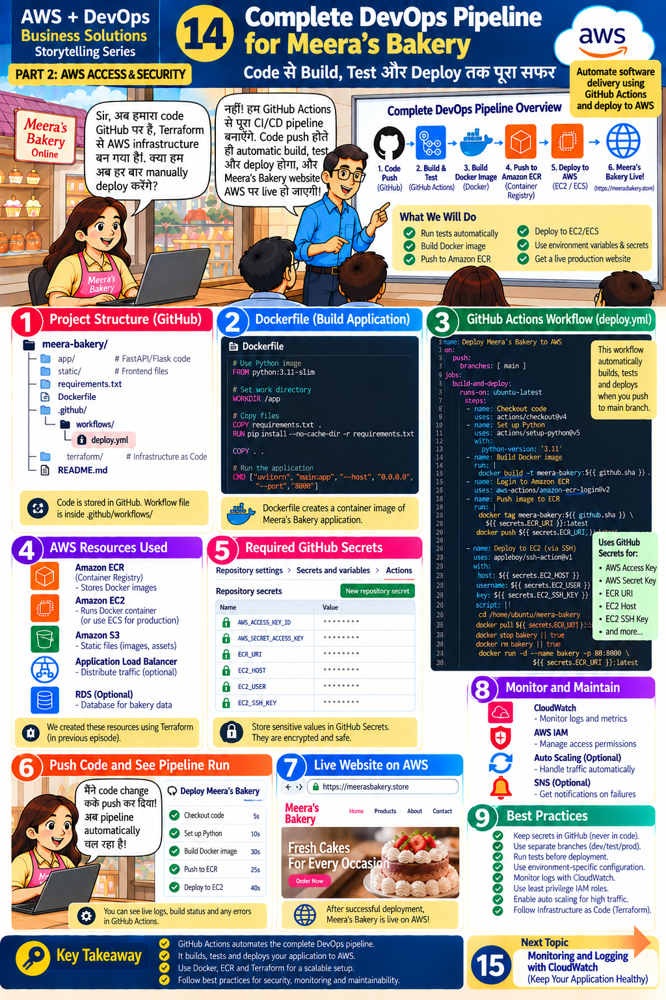

# Lesson 14 · Complete DevOps Pipeline for Meera's Bakery
**Code से Build, Test और Deploy तक पूरा सफ़र**

`Part 2 · AWS Access & Security` · ⏱ 150 min · 💰 Small (EC2 + ECR) — destroy afterwards · Level: Intermediate → Advanced



## 🎯 Learning objectives
- Connect everything: GitHub → Actions → Docker → ECR → EC2.
- Write a Dockerfile and run the app in a container.
- Build and push an image to **Amazon ECR** from a pipeline.
- Deploy the container to EC2 and verify the live site.

## 📖 The story
Meera: *"Now our code is on GitHub and Terraform built the AWS infrastructure. Do we still deploy manually every time?"*
Teacher: *"No! We'll build the complete CI/CD pipeline with GitHub Actions. As soon as code is pushed, it builds, tests and deploys, and the site goes live on AWS."*

## 🧠 Concepts

### The pipeline (top banner)
```
1. Code Push (GitHub)
2. Build & Test        (GitHub Actions)
3. Build Docker Image  (Docker)
4. Push to ECR         (Container Registry)
5. Deploy to AWS       (EC2 / ECS)
6. Meera's Bakery Live!
```

### Panel 1 — Project structure
```
meera-bakery/
├── app/            FastAPI code
├── static/         frontend files
├── requirements.txt
├── Dockerfile
├── .github/workflows/pipeline-docker.yml
├── terraform/      infrastructure as code
└── README.md
```

### Panel 2 — Dockerfile = recipe for a container image
```dockerfile
FROM python:3.11-slim            # base image with Python
WORKDIR /code                    # working directory
COPY requirements.txt .
RUN pip install --no-cache-dir -r requirements.txt   # cached layer
COPY app ./app
COPY static ./static
CMD ["uvicorn", "app.main:app", "--host", "0.0.0.0", "--port", "8000"]
```
(The slide uses `main:app`; our code is in the `app` package, so the module path is `app.main:app`.)

### Panel 4 — AWS resources used
**ECR** (stores Docker images) · **EC2** (runs the container; ECS for production) · **S3** (static files, images) · **ALB** (optional — distribute traffic) · **RDS** (optional — database).
Terraform from Lesson 13 already created ECR, EC2, S3 and the IAM role.

### Panel 5 — Required GitHub secrets
| Secret | Where to get it |
|--------|-----------------|
| `AWS_ACCESS_KEY_ID`, `AWS_SECRET_ACCESS_KEY` | deployer IAM user (Lesson 12) |
| `AWS_REGION` | `ap-south-1` |
| `ECR_URI` | `terraform output ecr_repository_url` |
| `EC2_HOST` | `terraform output web_public_ip` |
| `EC2_USER` | `ec2-user` (Amazon Linux) |
| `EC2_SSH_KEY` | private key of the EC2 key pair (full text) |

### How the EC2 server pulls the image *(not obvious in the slide)*
The deploy script logs Docker in to ECR **on the EC2 machine**. That works because the instance has an **IAM role** (`AmazonEC2ContainerRegistryReadOnly`, created by our Terraform) — **no keys are stored on the server**.

## 🛠️ Hands-on — step by step

### Part A — Run the container locally (Docker Desktop must be running)
```bash
docker build -t meera-bakery:local .
docker run --rm -p 8000:8000 --env-file .env meera-bakery:local
```
Open `http://localhost:8000/health` → `{"status":"ok",...}`. Stop with Ctrl+C.

### Part B — Prepare AWS (via Terraform, Lesson 13)
Add your SSH key pair and IP so you can connect (optional but needed for the SSH deploy):
```bash
# create an EC2 key pair in the console: EC2 ▸ Key pairs ▸ Create key pair (.pem) — keep it private!
terraform apply -var-file=envs/dev.tfvars \
  -var key_name=<your-keypair-name> -var allowed_ssh_cidr=<your-public-ip>/32
terraform output
```

### Part C — Push an image manually once (understand it before automating)
```bash
ECR=$(terraform -chdir=terraform output -raw ecr_repository_url)
aws ecr get-login-password --region ap-south-1 | docker login --username AWS --password-stdin ${ECR%%/*}
docker build -t meera-bakery:local .
docker tag meera-bakery:local $ECR:latest
docker push $ECR:latest
```
Console ▸ **ECR ▸ meera-bakery** shows the image.

### Part D — Configure GitHub (Lesson 12 steps 3 & 5)
Add the secrets from the table and the variable `DEPLOY_ENABLED=true`.

### Part E — Run the pipeline (panel 6)
Change something in `app/main.py` (e.g. the `/health` response), then:
```bash
git add . && git commit -m "Update health endpoint" && git push
```
Actions ▸ **Meera's Bakery - Docker to ECR to EC2** shows: Checkout → Test → Configure AWS → Login to ECR → Build image → Push to ECR → Deploy to EC2 (panel 6 timings: build ≈ 30 s, push ≈ 25 s, deploy ≈ 40 s).

### Part F — See your live site (panel 7)
Open `http://<EC2_HOST>/` and `http://<EC2_HOST>/health`. (Port 80 on the server maps to 8000 in the container; the security group opens port 80.)
Optional: point a domain with **Route 53** and add HTTPS with an **ALB + ACM certificate** (Lesson 16 direction).

### Part G — Monitor and maintain (panel 8)
CloudWatch for logs/metrics (Lesson 15) · IAM for access · Auto Scaling for traffic (Lesson 16) · SNS for failure notifications.

### Part H — Clean up 🧹
```bash
cd terraform && terraform destroy -var-file=envs/dev.tfvars
```

## 📁 Files for this lesson
`Dockerfile` · `.dockerignore` · `.github/workflows/pipeline-docker.yml` · `.github/workflows/ci.yml` · `terraform/main.tf` · `terraform/user_data.sh.tpl` · `app/`

## ⚠️ Common mistakes & fixes
| Symptom | Fix |
|---------|-----|
| `docker: command not found` / daemon not running | Start Docker Desktop |
| `no basic auth credentials` on pull/push | ECR login missing or expired (tokens last 12 h) |
| `denied: User ... is not authorized to perform ecr:...` | Deployer IAM policy lacks ECR permissions (`iam/github-actions-deploy-policy.json`) |
| SSH step times out | Security group has no port 22 rule for GitHub runners/your IP — SSH from GitHub runners needs port 22 open to GitHub's IP ranges; for stricter setups use **SSM Run Command** instead |
| Site not reachable | Security group port 80, container not running (`docker ps`), wrong port mapping |
| `ModuleNotFoundError: main` | CMD must be `app.main:app` for our folder layout |
| `docker pull` fails on EC2 | Instance profile missing or ECR login not run on EC2 |
| Secrets in the image | Never `COPY .env` or use `ENV` for secrets (`.dockerignore` blocks `.env`) |

## ✅ Best practices (panel 9)
Keep secrets in GitHub (never in code) · separate branches dev/test/prod · run tests before deployment · environment-specific configuration · log with CloudWatch · least-privilege IAM roles · auto-scale for traffic · Terraform for infrastructure · tag images with the commit SHA (we push both `:sha` and `:latest`, so you can roll back).

## 📝 Quiz
1. Put in order: Build image, Push to ECR, Test, Deploy, Code push.
2. What is ECR?
3. How does EC2 authenticate to ECR without stored keys?
4. Why tag images with the commit SHA?
5. What does `-p 80:8000` mean?

<details><summary>Show answers</summary>

1. Code push → Test → Build image → Push to ECR → Deploy.  2. AWS registry for Docker images.  3. Through its IAM instance role.  4. Traceability and easy rollback.  5. Host port 80 → container port 8000.
</details>

## 🏠 Assignment
Add a smoke-test step at the end of the pipeline that calls `http://${{ secrets.EC2_HOST }}/health` with `curl --fail` (retry a few times) so a broken deployment turns the run red. Draw the final architecture diagram.

## 🔑 Key takeaway
GitHub Actions automates the complete DevOps pipeline: it builds, tests and deploys your application
to AWS. Use Docker, ECR and Terraform for a scalable setup; follow best practices for security, monitoring and maintainability.

**हिंदी में सार:** Code push → test → Docker image build → ECR में push → EC2 पर deploy → site live। Secrets GitHub में,
infrastructure Terraform से, और monitoring CloudWatch से।

⬅️ [Lesson 13](13-terraform.md) · ➡️ **Next:** [Lesson 15 — CloudWatch](15-cloudwatch.md)
