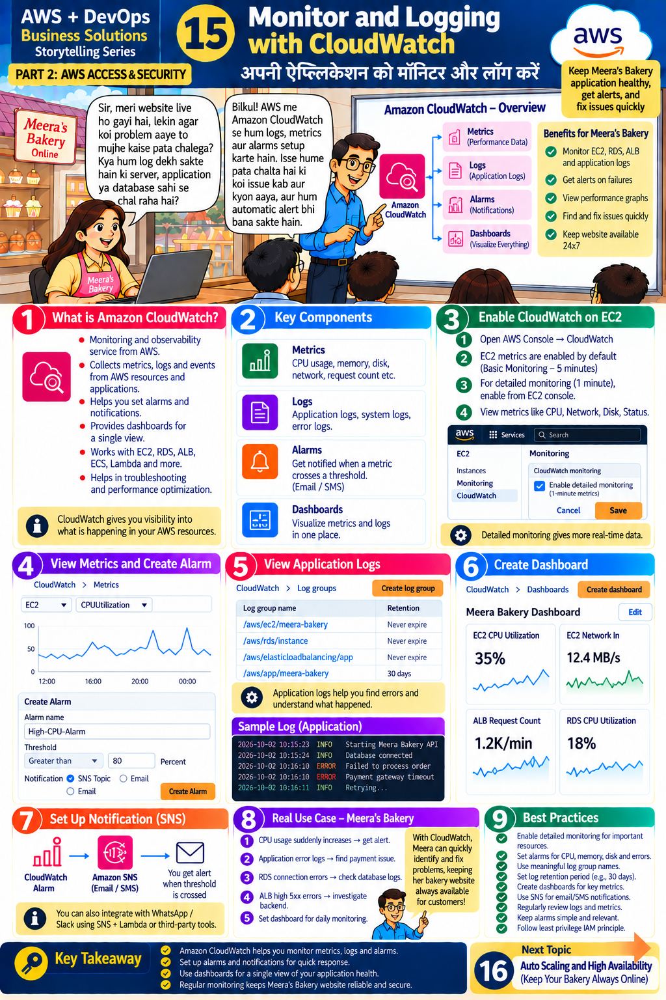

# Lesson 15 · Monitor and Logging with CloudWatch
**अपनी ऐप्लिकेशन को मॉनिटर और लॉग करें**

`Part 2 · AWS Access & Security` · ⏱ 90 min · 💰 Mostly free tier (alarms/dashboards have limits) · Level: Intermediate



## 🎯 Learning objectives
- Explain **metrics, logs, alarms and dashboards**.
- View EC2 metrics and create a CPU alarm with e-mail notification (SNS).
- Find application errors in CloudWatch Logs.
- Build a dashboard for the bakery.

## 📖 The story
Meera: *"My website is live, but if a problem happens, how will I know? Can we see logs? Can we get an alert automatically?"*
Teacher: *"Yes! **Amazon CloudWatch** shows logs and metrics and sets alarms — we learn about issues early and fix them quickly."*

## 🧠 Concepts

### CloudWatch overview (top banner)
`Metrics` (performance data) · `Logs` (application logs) · `Alarms` (notifications) · `Dashboards` (visualise everything).
**Benefits:** monitor EC2/RDS/ALB and app logs · alerts on failures · performance graphs · find and fix issues quickly · keep the website available 24×7.

### Key components (panel 2)
| Component | Meaning | Example |
|-----------|---------|---------|
| **Metrics** | Numbers over time | CPUUtilization, NetworkIn, request count |
| **Logs** | Text records | application logs, system logs, error logs |
| **Alarms** | Notify when a metric crosses a threshold | CPU > 80 % → e-mail/SMS |
| **Dashboards** | Charts in one place | the "Meera Bakery Dashboard" |

### Enable monitoring on EC2 (panel 3)
- **Basic monitoring** is on by default: metrics every **5 minutes**, free.
- **Detailed monitoring**: **1-minute** metrics (small extra cost) — EC2 ▸ instance ▸ *Monitoring* tab ▸ *Manage detailed monitoring*.
- Default EC2 metrics include CPU, network, disk I/O and status checks. **Memory and disk-space usage are *not* collected by default** — install the **CloudWatch Agent** for those.

### Alarm → SNS → you (panels 4 & 7)
`CloudWatch Alarm` ⟶ `Amazon SNS topic` ⟶ `E-mail / SMS`. (You can also push to WhatsApp or Slack using SNS + Lambda or third-party tools.)

### Logs (panel 5)
Log groups hold log streams: e.g. `/aws/ec2/meera-bakery`, `/aws/rds/instance`, `/aws/app/meera-bakery`. Set **retention** (e.g. 30 days) so old logs don't cost money forever.

### Real use cases for Meera (panel 8)
| Event | Action |
|-------|--------|
| CPU suddenly increases | alarm → alert |
| App error logs | find the payment issue |
| RDS connection errors | check database logs |
| ALB high 5xx errors | investigate backend |
| — | dashboard for daily monitoring |

## 🛠️ Hands-on — step by step

### Part A — View metrics and create an alarm in the console (panel 4)
1. Console → **CloudWatch ▸ Metrics ▸ All metrics ▸ EC2 ▸ Per-Instance Metrics** → tick `CPUUtilization` for your instance (from Lesson 13) → see the graph.
2. **Alarms ▸ Create alarm ▸ Select metric** → `CPUUtilization` → Statistic *Average*, Period *5 minutes*.
3. Condition: **Greater than 80** (percent) → *Next*.
4. Notification: **Create new SNS topic** → name `meera-bakery-alerts` → enter your e-mail → *Next*.
5. Alarm name `High-CPU-Alarm` → Create. **Open your inbox and confirm the SNS subscription** (alerts won't arrive until you do).

### Part B — Same with Python
```bash
python scripts/cw_create_alarm.py <instance-id> you@example.com
python scripts/cw_create_dashboard.py <instance-id>
```
(`terraform output web_instance_id` gives the ID.) If you applied Terraform with `-var alert_email=you@example.com`, `monitoring.tf` already created the alarm, SNS topic, log group and dashboard — look at that file to see the same thing as code.

### Part C — Test the alarm (safe stress test)
Connect to the instance (EC2 ▸ Connect ▸ **Session Manager**, works because our role includes `AmazonSSMManagedInstanceCore`) and run for ~10 minutes:
```bash
sudo dnf install -y stress-ng
stress-ng --cpu 2 --timeout 600s
```
After two 5-minute periods the alarm goes **In alarm** and you receive the e-mail. Stop the test and watch it return to **OK**.

### Part D — Application logs (panels 5 & 8)
Our app writes logs in the format shown in the slide (`INFO`/`ERROR` lines) to stdout (`app/logging_config.py`). Send container logs to CloudWatch:
```bash
docker run -d --name bakery -p 80:8000 \
  --log-driver=awslogs \
  --log-opt awslogs-region=ap-south-1 \
  --log-opt awslogs-group=/aws/app/meera-bakery \
  --log-opt awslogs-create-group=true \
  <ECR_URI>:latest
```
(The EC2 role needs log-write permission — `CloudWatchAgentServerPolicy` in our Terraform covers it.)
Then: CloudWatch ▸ **Log groups ▸ /aws/app/meera-bakery** → open a stream. Use **Logs Insights**:
```
fields @timestamp, @message
| filter @message like /ERROR/
| sort @timestamp desc
| limit 20
```
Generate an error: upload a `.txt` file to `POST /products/upload` (HTTP 415) or stop S3 access and see `ERROR` lines.
CLI: `aws logs tail /aws/app/meera-bakery --follow`.

### Part E — Dashboard (panel 6)
CloudWatch ▸ **Dashboards ▸ Create dashboard** → add widgets: EC2 CPUUtilization, EC2 NetworkIn, ALB RequestCount, RDS CPUUtilization (when you have them). Or use `scripts/cw_create_dashboard.py`.

### Part F — Clean up 🧹
Delete alarms, dashboards, SNS topic and log groups (or `terraform destroy`). Stop the stress test.

## 📁 Files for this lesson
`scripts/cw_create_alarm.py` · `scripts/cw_create_dashboard.py` · `terraform/monitoring.tf` · `app/logging_config.py` · `app/main.py` (log lines)

## ⚠️ Common mistakes & fixes
| Symptom | Fix |
|---------|-----|
| No alarm e-mails | SNS subscription not **confirmed** (check spam) |
| Alarm stuck on *Insufficient data* | Instance stopped, wrong dimension/InstanceId, or metrics every 5 min (wait) |
| No memory/disk metrics | Install the **CloudWatch Agent** |
| Logs missing | Log group/Region mismatch, no IAM permission, app writing to a file not stdout |
| Big bill from logs | Set retention; avoid DEBUG logging in production |
| Alarm flapping | Use more evaluation periods / sensible thresholds |

## ✅ Best practices (panel 9)
Enable detailed monitoring for important resources · alarms for CPU, memory, disk and errors · meaningful log-group names · retention period (e.g. 30 days) · dashboards for key metrics · SNS for e-mail/SMS notifications · review logs and metrics regularly · keep alarms simple and relevant · least-privilege IAM.

## 📝 Quiz
1. Four CloudWatch components?
2. Default EC2 monitoring interval? Detailed?
3. Which service delivers the alarm e-mail?
4. Does CloudWatch show EC2 memory usage by default?
5. Why set log retention?

<details><summary>Show answers</summary>

1. Metrics, Logs, Alarms, Dashboards.  2. 5 min; 1 min.  3. SNS.  4. No — needs the CloudWatch Agent.  5. Controls storage cost and keeps logs manageable.
</details>

## 🏠 Assignment
Create an alarm that fires when the app logs more than 5 `ERROR` lines in 5 minutes (**metric filter** on the log group → alarm). Document the steps with screenshots.

## 🔑 Key takeaway
CloudWatch helps you monitor metrics, logs and alarms. Set alarms and notifications for quick response,
use dashboards for a single view of health, and review regularly to keep Meera's Bakery reliable and secure.

**हिंदी में सार:** CloudWatch से metrics, logs और alarms मिलते हैं। CPU जैसी limit पार होने पर SNS से e-mail/SMS alert आता है।
Dashboard से पूरा system एक नज़र में दिखता है।

⬅️ [Lesson 14](14-complete-devops-pipeline.md) · ➡️ **Next:** [Lesson 16 — Auto Scaling & High Availability](16-next-auto-scaling.md)
